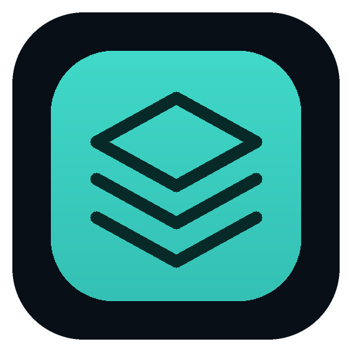
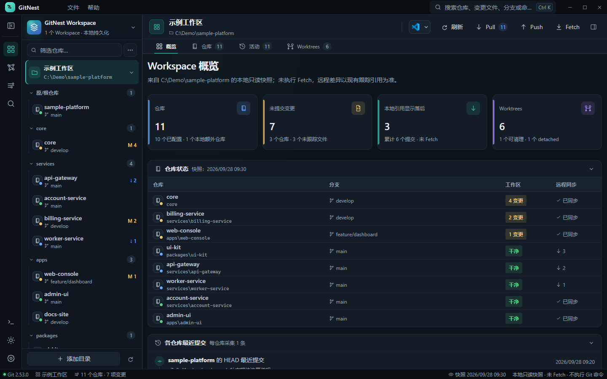
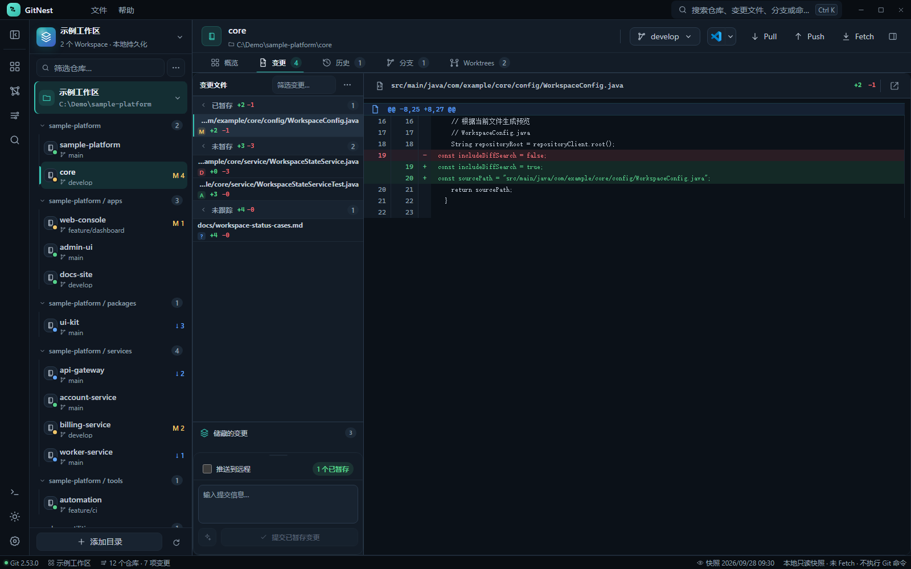
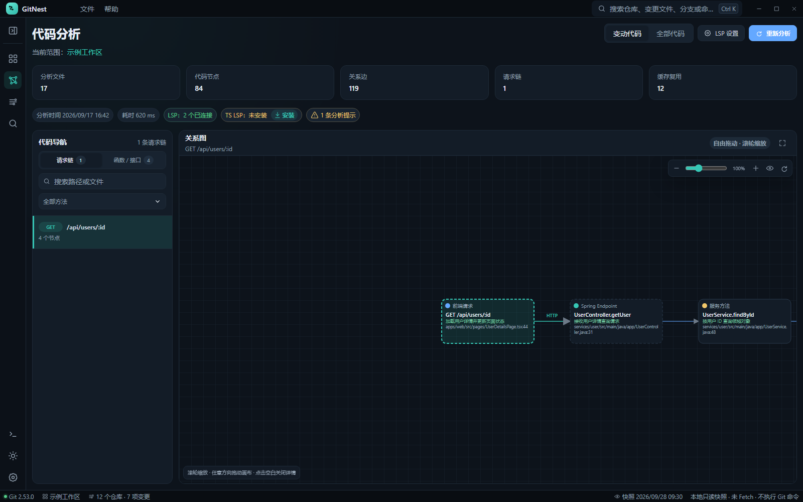

<div align="center">
  
  <h1>GitNest</h1>
  <p>Windows 本地优先的多 Workspace、多仓库 Git 工作台与代码关系分析工具</p>
</div>

GitNest 面向需要同时维护多个项目和仓库的开发者。它把多个 Workspace、目录中的 Git 仓库以及 Git Worktree 放进一个桌面工作台，集中处理日常 Git 操作；还可以从变更或整个项目中建立代码关系图，把前端请求与后端处理链路串起来。

## 核心特色

### 以 Workspace 管理多项目、多仓库

- 创建并切换多个 Workspace，分别维护项目集合和工作状态。
- 将聚合目录、普通目录和独立仓库加入 Workspace；扫描目录时自动发现其中的 Git 仓库并按目录组织。
- 通过文件夹选择、路径输入或拖入目录添加项目，重复路径会被识别，不会重复登记。
- 在总览中对比各仓库的分支、工作区变更和远程同步状态，并快速定位到具体仓库或 Worktree。



<p align="center"><sub>多仓总览原型：按目录分组查看仓库、分支、未提交变更和远程同步状态。</sub></p>

### 在同一个工作台完成日常 Git 工作

- 按已暂存、未暂存和未跟踪文件浏览本地变更，逐文件检查 Diff；支持列表或目录树筛选、Diff 内搜索和变更块上下文展开，并可暂存、取消暂存或丢弃变更。
- 查看提交历史和提交详情，并按文件审阅历史提交 Diff；管理分支并执行 Fetch、Pull、Push 和 Commit。
- 浏览已有 Stash 的文件与差异，并执行 Apply、Pop 或 Drop。
- 在操作中心查看任务目标、排队与执行状态、进度、结果和失败原因；长操作可以取消。
- 后台状态刷新与用户操作记录分离，自动刷新成功不会挤占操作历史。



<p align="center"><sub>变更审阅原型：按暂存状态浏览文件，并在同一页面检查代码 Diff。</sub></p>

### 完整管理 Git Worktree

GitNest 将仓库和 Worktree 作为不同目标追踪。同一仓库的多个工作目录可以分别查看分支、变更和状态，减少对错目录操作的风险。界面支持创建、锁定/解锁、移动、修复登记、Prune 和移除 linked Worktree，并在执行前检查目标和影响。

### 从代码变更追踪跨层调用链

- 可分析当前项目的 Git 变更，也可按需分析整个 Workspace；变更分析优先复用已有索引。
- 内置解析支持 JavaScript、TypeScript、Vue 和 Java，可将前端 `fetch`/Axios 请求与 Java Spring 路由及后续调用关系关联起来。
- 可按协议符号关联 Java RPC 客户端与服务端入口，并在图中保留中间调用节点。
- 关系图支持按请求、符号和语言查找；节点详情包含源码位置、关系来源及置信度。多候选关系会保留为候选，不会静默猜测。
- 可配置 Language Server Protocol（LSP）为支持的语言补充符号和调用层级信息；LSP 不可用时可使用内置静态分析结果。



<p align="center"><sub>代码分析原型：从前端 HTTP 请求查看后端 Spring 路由及后续服务调用。</sub></p>

### 通过只读 MCP 把代码关系提供给 Codex

GitNest 提供本机 MCP 服务，可让 Codex 查询已生成的分析快照，包括可用项目、快照状态和函数/路由调用链。MCP 查询只读取现有快照，不会修改仓库、重新运行分析或启动 LSP；结果会附带新鲜度和完整性信息。是否向 MCP 客户端提供源码片段可在设置中控制。

### 本地优先，辅助能力由你选择

- GitNest 调用本机安装的 Git for Windows 管理仓库；Git 网络操作由用户发起，也可在设置中选择启动后 Fetch。
- 默认沿用系统 Git 认证；也可配置 GitHub、GitLab、Gitee 或自定义主机账号。访问令牌和 AI API Key 保存在操作系统保护的凭据存储中。
- 可选的 AI 提交说明功能兼容 OpenAI Chat Completions API。用户点击生成后，GitNest 将对应的待提交 Diff 发给所配置的服务，并只把返回内容填入提交说明编辑框；不会自动暂存、提交或推送。
- 可从仓库或 Worktree 打开外部终端与编辑器。

## Windows 发行版

Windows x64 发布流程会生成安装版和 Portable 版，并提供 SHA-256 校验文件。安装版可检查正式版本更新；下载和安装由用户确认，不会静默强制更新。

## 开发

需要 Node.js 22 或更高版本、pnpm 11.19.0 和 Git for Windows。

```powershell
pnpm install
pnpm dev
```

常用检查与构建命令：

```powershell
pnpm check:architecture
pnpm typecheck
pnpm test
pnpm build
pnpm dist:win
```

## 界面预览

以上截图来自静态交互原型，仓库、路径、提交记录和源码均为虚构示例，不代表真实项目数据。原型位于 [`prototypes/workspace-shell/index.html`](prototypes/workspace-shell/index.html)，仅用于界面预览，不会读取本机文件或执行 Git 命令。
