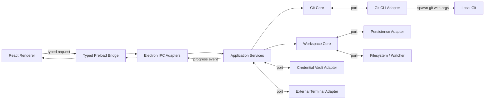

# GitNest 多仓 Workspace 架构与界面设计

- 日期：2026-09-04
- 状态：M1、M2、M3、三轮最终硬化与 1.0.0 总集成全部验收通过
- 技术路线：Electron + React + TypeScript + Node.js
- 目标平台：Windows 优先，平台相关能力通过适配器隔离
- Git 实现：调用用户已安装的 Git for Windows
- 正式版本范围：Workspace 发现、日常 Git 工作流、混合认证、完整 Worktree 管理
- 开发方式：M1、M2、M3 三个可运行里程碑，全部完成后发布首个正式版本

## 1. 设计结论

GitNest 是本地优先的多仓 Git 桌面工具，以 Workspace 为一级产品对象，而不是在单仓 Git 客户端外层增加一个仓库列表。

一个 Workspace 可以包含多个同级顶层条目：聚合型 `Workspace 元仓库`、根目录自身不是 Git 仓库的 `Workspace 目录`，以及单独添加的 `普通仓库`。同一仓库实例还可以包含多个 Worktree。

用户可以通过文件夹选择、手动路径和目录拖拽三种入口添加顶层条目。三种入口共用同一套发现、分类、路径去重和分组流程。

首个正式版本同时覆盖：

- Workspace 多根目录扫描、自动分类、分组、缓存和监听。
- Diff、Stage、Unstage、Commit、历史、Fetch、Pull、Push 和分支管理。
- 系统 Git 认证与 GitNest 账号中心组成的混合认证。
- Worktree 创建、锁定、移动、修复、Prune 和安全移除。
- 在当前仓库或 Worktree 中启动外部终端。

架构采用端口与适配器方式隔离七类职责：

1. `git-core` 定义 Git 领域模型、解析器和能力接口，不依赖 Electron、React 或 Node.js 进程 API。
2. `git-cli` 负责安全调用本机 Git CLI，并把文本输出转换为 `git-core` 模型。
3. `workspace-core` 定义 Workspace、仓库发现、分组、聚合状态和 Worktree 归属规则。
4. `application` 编排单仓与多仓用例，负责操作队列、并发、取消、缓存失效和聚合结果。
5. `persistence-json` 保存 Workspace、界面状态和非敏感账号元数据。
6. Main 进程中的 Credential Vault 适配器通过操作系统安全存储保存 Token，不把密钥写入普通 JSON。
7. Electron 与 React 分别作为桌面系统适配层和展示层，只通过受控 IPC 契约通信。

这套边界允许未来增加 OAuth、托管平台 MR/Issue、内置终端、Checkpoint 或 AI Coding，而不需要把这些能力写入 Git 服务或 React 根组件。

## 2. 产品对象

### 2.1 Workspace

Workspace 表示用户希望统一管理的一组本地目录和仓库。顶层条目可以是聚合根目录，也可以是普通仓库。

```ts
interface Workspace {
  id: string;
  name: string;
  entries: WorkspaceEntry[];
  settings: WorkspaceSettings;
}

type WorkspaceEntry =
  | AggregateWorkspaceEntry
  | DirectoryWorkspaceEntry
  | StandaloneRepositoryEntry;

interface WorkspaceRootEntry {
  id: string;
  displayName: string;
  path: string;
  canonicalPath: string;
  excludes: string[];
  order: number;
}

interface AggregateWorkspaceEntry extends WorkspaceRootEntry {
  kind: "workspace-meta-repository";
  rootTarget: RepositoryTarget;
  groups: RepositoryGroup[];
}

interface DirectoryWorkspaceEntry extends WorkspaceRootEntry {
  kind: "workspace-directory";
  groups: RepositoryGroup[];
}

interface StandaloneRepositoryEntry extends WorkspaceRootEntry {
  kind: "standalone-repository";
  target: RepositoryTarget;
}

interface RepositoryGroup {
  id: string;
  name: string;
  targets: RepositoryTarget[];
}
```

顶层自动分类规则：

- 根目录自身是 Git 仓库，且内部还有独立仓库：`Workspace 元仓库`。
- 根目录自身不是 Git 仓库，但内部包含仓库：`Workspace 目录`。
- 根目录自身是 Git 仓库，且内部没有其他独立仓库：`普通仓库`。
- 没有发现 Git 仓库：展示扫描结果，但不加入 Workspace。

添加与展示规则：

- 文件夹选择、手动路径和拖拽目录始终把输入目录作为顶层扫描入口。
- 根目录自身是仓库时仍继续扫描子目录。
- 聚合型顶层节点内部，Workspace 根目录仓库和直属子仓库进入 `原/根仓库`；更深层仓库使用相对路径第一个目录名分组。
- 多个聚合目录和普通仓库在侧栏同级显示。
- 顶层节点展示名称、类型标识和完整路径，以区分不同盘符下的同名仓库。
- 完全相同的规范化路径重复添加时定位已有条目，不重复创建。
- 根目录重叠时，仓库显示在路径最具体的已添加根目录下。
- 默认排除 `.git`、`node_modules`、`.pnpm`、`.venv`、`vendor`、`target`、`dist`、`build`、缓存和临时目录。
- 默认不跟随指向 Workspace 根目录之外的符号链接，防止无限扫描和越权访问。
- 发现非根级子仓库后默认停止继续扫描其内部；如果用户需要把该仓库作为新的聚合根目录，可以单独添加。
- 单个目录无权访问或扫描失败时记录局部错误，其他目录继续扫描。
- 扫描过程只读，不执行 Fetch、Pull、Checkout、Clean 或文件写入。

### 2.2 Repository

RepositoryInstance 表示一个本地 Git common directory 对应的仓库实例。它不表示远程项目，也不根据远程 URL 合并。

```ts
interface RepositoryInstance {
  id: string;
  name: string;
  commonDir: string;
  primaryWorktreeId?: string;
  worktreeIds: string[];
  remotes: RepositoryRemote[];
}

interface Worktree {
  id: string;
  repositoryId: string;
  path: string;
  gitDir: string;
  branch?: string;
  head: string;
  isPrimary: boolean;
  isLocked: boolean;
  lockReason?: string;
}

interface RepositoryTarget {
  repositoryId: string;
  worktreeId: string;
}
```

身份规则：

- RepositoryInstance ID 基于规范化后的本地 `commonDir` 绝对路径生成，不使用名称、Remote URL 或列表序号。
- `D:\code\sc\sc_code` 与 `E:\code\sc\sc_code` 始终是两个独立本地实例，即使 Remote 和提交完全相同。
- Worktree ID 基于规范化后的工作目录绝对路径生成。
- 所有可操作和可展示的仓库节点使用 `RepositoryTarget`，同时指定仓库实例和具体 Worktree；因此同一 RepositoryInstance 的多个工作目录不会被 UI 或命令目标混淆。
- 共享同一个 `commonDir` 的 Primary 和 linked worktree 归属同一个 RepositoryInstance，但分别展示路径和状态。
- 用户拖入 linked worktree 时，自动关联已有 RepositoryInstance；不存在时创建本地仓库实例并读取其 Worktree 列表。

Windows 首版的规范化规则为：转换为绝对路径、统一目录分隔符、移除非盘符根路径末尾的分隔符，并按 Windows 大小写不敏感语义比较。界面保留用户添加时的显示路径；符号链接和 Junction 的最终路径仅用于扫描循环检测与越界校验，不替换用户可见路径。

### 2.3 RepositorySnapshot

Snapshot 是 UI 获取仓库状态的只读投影。

```ts
interface RepositorySnapshot {
  repositoryId: string;
  worktreeId: string;
  branch?: string;
  head: string;
  upstream?: string;
  ahead: number;
  behind: number;
  staged: number;
  unstaged: number;
  untracked: number;
  conflicted: number;
  operationState?: "merge" | "rebase" | "cherry-pick" | "revert" | "bisect";
  refreshPending?: boolean;
  refreshedAt: string;
}
```

Workspace 总览只读取 Snapshot，不直接请求每个页面需要的完整历史或 Diff，避免打开大 Workspace 时产生无界 Git 进程。

### 2.4 Operation

Operation 表示一次可观察、可取消的后台任务。

```ts
interface Operation {
  id: string;
  kind:
    | "scan"
    | "status"
    | "fetch"
    | "pull"
    | "push"
    | "stage"
    | "unstage"
    | "commit"
    | "switch-branch"
    | "create-branch"
    | "rename-branch"
    | "delete-branch"
    | "worktree-create"
    | "worktree-lock"
    | "worktree-unlock"
    | "worktree-move"
    | "worktree-repair"
    | "worktree-prune"
    | "worktree-remove";
  scope: "workspace" | "repository" | "worktree";
  targetIds: string[];
  state: "queued" | "preflighting" | "running" | "succeeded" | "failed" | "cancelling" | "cancelled";
  progress?: number;
  message?: string;
  startedAt?: string;
  finishedAt?: string;
}
```

Workspace 批量操作由多个独立的 Repository Operation 组成。部分仓库失败时保留其他仓库的成功结果，不伪装成跨仓事务，也不自动回滚已经完成的 Git 操作。

### 2.5 AccountProfile

GitNest 默认复用系统 Git 认证；只有用户显式配置账号时才使用账号中心。

```ts
interface AccountProfile {
  id: string;
  provider: "github" | "gitlab" | "gitee" | "custom";
  host: string;
  username?: string;
  authType: "https-token" | "system-ssh";
  credentialRef?: string;
}

interface RepositoryAccountBinding {
  repositoryId?: string;
  host: string;
  accountId: string;
}
```

认证优先级为：仓库显式绑定账号、主机默认 GitNest 账号、系统 Git Credential Helper 或 SSH 配置。

## 3. 运行时架构



依赖只能沿箭头方向流动：

- `git-core` 和 `workspace-core` 不得导入 Electron、React、Node.js `child_process` 或具体存储库。
- `git-cli` 实现 `git-core` 定义的端口。
- `application` 可以组合 Git 与 Workspace 能力，但不直接操作窗口或 React 状态。
- Renderer 不得直接使用 `ipcRenderer`，只调用 preload 暴露的类型化 API。
- Electron IPC handler 不承载业务流程，只做参数校验、调用用例和错误映射。
- Token 首次录入时只短暂存在于受控账号表单，并通过专用 IPC 单向提交给 Main；提交后只有 Credential Vault 和临时认证代理能够重新读取，Renderer 不具备凭据回读能力。
- 平台相关的路径、进程、凭据和终端能力都通过适配器实现；首版只提供 Windows 适配器。

## 4. 建议目录

```text
GitNest/
├─ apps/
│  └─ desktop/
│     ├─ package.json
│     └─ src/
│        ├─ main/
│        │  ├─ bootstrap/
│        │  │  ├─ create-application.ts
│        │  │  └─ register-services.ts
│        │  ├─ windows/
│        │  │  ├─ main-window.ts
│        │  │  └─ window-state.ts
│        │  ├─ ipc/
│        │  │  ├─ register-ipc.ts
│        │  │  ├─ workspace.handlers.ts
│        │  │  ├─ repository.handlers.ts
│        │  │  ├─ operation.handlers.ts
│        │  │  ├─ account.handlers.ts
│        │  │  └─ system.handlers.ts
│        │  ├─ adapters/
│        │  │  ├─ filesystem.adapter.ts
│        │  │  ├─ watcher.adapter.ts
│        │  │  ├─ dialog.adapter.ts
│        │  │  ├─ external-link.adapter.ts
│        │  │  ├─ external-terminal.adapter.ts
│        │  │  └─ credential-vault.adapter.ts
│        │  └─ index.ts
│        ├─ preload/
│        │  ├─ bridge.ts
│        │  └─ index.ts
│        └─ renderer/
│           ├─ app/
│           │  ├─ App.tsx
│           │  ├─ providers.tsx
│           │  ├─ router.tsx
│           │  └─ styles/
│           ├─ pages/
│           │  ├─ workspace-overview/
│           │  └─ repository/
│           ├─ widgets/
│           │  ├─ app-titlebar/
│           │  ├─ activity-rail/
│           │  ├─ workspace-sidebar/
│           │  ├─ repository-header/
│           │  ├─ operation-center/
│           │  └─ detail-inspector/
│           ├─ features/
│           │  ├─ workspace-open/
│           │  ├─ workspace-scan/
│           │  ├─ workspace-bulk-sync/
│           │  ├─ repository-refresh/
│           │  ├─ repository-sync/
│           │  ├─ changes-stage/
│           │  ├─ changes-commit/
│           │  ├─ branch-switch/
│           │  ├─ account-manage/
│           │  ├─ external-terminal-open/
│           │  └─ worktree-manage/
│           ├─ entities/
│           │  ├─ workspace/
│           │  ├─ repository/
│           │  ├─ worktree/
│           │  ├─ account/
│           │  ├─ change/
│           │  ├─ commit/
│           │  └─ operation/
│           └─ shared/
│              ├─ api/
│              ├─ hooks/
│              ├─ lib/
│              └─ ui/
├─ packages/
│  ├─ contracts/
│  │  └─ src/
│  │     ├─ channels.ts
│  │     ├─ workspace.contracts.ts
│  │     ├─ repository.contracts.ts
│  │     ├─ operation.contracts.ts
│  │     ├─ account.contracts.ts
│  │     ├─ events.ts
│  │     └─ errors.ts
│  ├─ git-core/
│  │  └─ src/
│  │     ├─ domain/
│  │     ├─ ports/
│  │     ├─ parsers/
│  │     ├─ capabilities/
│  │     └─ errors/
│  ├─ git-cli/
│  │  └─ src/
│  │     ├─ process/
│  │     ├─ commands/
│  │     ├─ adapters/
│  │     ├─ environment/
│  │     └─ index.ts
│  ├─ workspace-core/
│  │  └─ src/
│  │     ├─ domain/
│  │     ├─ discovery/
│  │     ├─ services/
│  │     ├─ ports/
│  │     └─ errors/
│  ├─ application/
│  │  └─ src/
│  │     ├─ workspace/
│  │     ├─ repository/
│  │     ├─ account/
│  │     ├─ terminal/
│  │     ├─ operations/
│  │     ├─ cache/
│  │     └─ events/
│  ├─ persistence-json/
│  │  └─ src/
│  │     ├─ workspace.repository.ts
│  │     ├─ preferences.repository.ts
│  │     ├─ account-metadata.repository.ts
│  │     ├─ migrations/
│  │     └─ atomic-json-store.ts
│  ├─ design-system/
│  │  └─ src/
│  │     ├─ tokens/
│  │     ├─ primitives/
│  │     ├─ patterns/
│  │     └─ icons/
│  └─ testkit/
│     └─ src/
│        ├─ git-repository-fixture.ts
│        ├─ fake-git-client.ts
│        └─ fake-workspace-store.ts
├─ prototypes/
│  └─ workspace-shell/
│     └─ index.html
├─ docs/
│  ├─ superpowers/specs/
│  └─ adr/
├─ package.json
├─ pnpm-workspace.yaml
├─ tsconfig.base.json
└─ eslint.config.js
```

### 4.1 不提前创建的包

首个生产版本不创建空的 `terminal-core`、`checkpoint-core`、`provider-oauth` 或 `ai-core` 包。后续能力达到可独立验收的范围后再增加：

- 当前只通过 `ExternalTerminalPort` 启动外部终端；内置终端达到独立范围后再增加 `terminal-core`。
- Checkpoint 通过 `WorkspaceSnapshotPort` 接入，不与 Git stash 强绑定。
- OAuth 在接入 MR、Issue 等托管平台能力时通过 Provider Adapter 增加。
- AI Coding/CLI 通过 `WorkspaceToolProvider` 获取受控的仓库、终端和文件系统能力。

这样可以保留扩展边界，同时避免为了“以后可能需要”维护空目录和虚假抽象。

## 5. 核心模块职责

### 5.1 `packages/git-core`

负责：

- Git 状态、提交、引用、分支、远程、Diff 和 Worktree 的领域模型。
- `GitClient`、`GitReader`、`GitWriter` 等端口。
- `status --porcelain=v2 -z`、`for-each-ref`、`log` 和 `worktree list --porcelain` 等输出的纯解析器。
- 与平台无关的错误分类和命令结果。

不负责：

- 启动子进程。
- 弹出认证窗口。
- 保存 Workspace。
- 发送 Electron 事件。

### 5.2 `packages/git-cli`

负责：

- 使用 `spawn` 直接执行 `git`，参数使用数组传递，禁止拼接 shell 命令。
- 发现 Git 可执行文件和版本。
- 处理 UTF-8、超时、取消、标准输入输出与 Windows 进程树终止。
- 实现凭据辅助器、SSH 主机确认和长操作进度解析。
- 把 CLI 结果交给 `git-core` 解析器。

每次执行都产生结构化诊断信息，但默认不把远程地址中的凭据或环境变量写入日志。

### 5.3 `packages/workspace-core`

负责：

- Workspace 顶层条目、自动分类和仓库分组。
- 仓库发现、路径规范化、精确路径去重和 Worktree 归属。
- Workspace 级过滤、排序、收藏和状态聚合规则。
- 定义 Workspace 存储、文件扫描和文件监听端口。

### 5.4 `packages/application`

负责具体用例：

- 打开 Workspace。
- 扫描或重新扫描仓库。
- 获取 Workspace Snapshot。
- 获取仓库详情。
- 对一个或多个仓库执行 Fetch、Pull、Push。
- 提交、切换分支和管理 Worktree。
- 管理账号绑定、调用凭据端口和启动外部终端。
- 管理操作队列、取消令牌、缓存与事件。

它是唯一允许同时依赖 `git-core` 与 `workspace-core` 的业务层。

### 5.5 `packages/contracts`

负责 Renderer、Preload 和 Main 共享的稳定契约：

- IPC channel 常量。
- 请求、响应和事件 DTO。
- 输入校验 schema。
- 可安全跨进程传输的错误结构。

契约不得暴露 `child_process`、文件句柄、Electron Event 或领域服务实例。

### 5.6 `packages/persistence-json`

负责带 `schemaVersion` 的 Workspace、界面状态、偏好和非敏感账号元数据。写入使用临时文件与原子替换，不得保存 Token 或私钥。

### 5.7 `packages/design-system`

把 `DESIGN.md` 中的颜色、排版、间距、组件状态和布局约束实现为可复用 Token、Primitive 和 Pattern。生产界面必须延续已确认的 HTML 原型视觉基线。

### 5.8 `packages/testkit`

提供临时 Git 仓库、Worktree、Remote、Fake Git Client、Fake Store 和路径 Fixture。任何破坏性集成测试只能作用于自动创建的临时目录。

### 5.9 Renderer

Renderer 使用页面、Widget、Feature、Entity 和 Shared 五级组织方式：

- Page 决定页面组合，不保存 Git 业务逻辑。
- Widget 表示稳定的大块界面，例如 Workspace Sidebar 或 Operation Center。
- Feature 表示用户动作，例如批量 Fetch、暂存文件或切换分支。
- Entity 维护 Workspace、Repository、Operation 等前端模型和查询缓存。
- Shared 只放无业务归属的 UI 基础组件和工具。

页面不得直接调用 Git 命令，也不得在根 `App.tsx` 中集中维护全部仓库状态。

## 6. Git 执行与并发规则

所有 Git 操作经过：IPC 参数校验、权限与状态预检、必要时的用户确认、操作队列、Git CLI 执行、结果解析、状态失效和 UI 事件通知。

GitNest 启动时检测用户安装的 Git for Windows 路径、版本、LFS、Credential Helper 和 SSH 环境。命令使用 `spawn(gitPath, args)` 执行白名单参数，禁止 `shell: true`、字符串命令和 Renderer 自定义 Git 参数。

Pull、Push、分支变更和 Worktree 写操作使用两阶段协议：

1. Renderer 请求预检，Main 返回目标、影响、警告、是否需要二次确认，以及短期有效且绑定命令参数的 `preflightId`。
2. Renderer 展示预检结果；需要确认时由用户明确确认，再携带 `preflightId` 请求执行。
3. Main 在入队前重新读取关键状态。预检已过期、命令参数变化或影响集合变化时拒绝执行，并要求重新预检。

Stage、Unstage 和 Commit 不要求单独预检请求，但 Main 仍在执行前校验目标路径和仓库状态。

### 6.1 读取操作

- Workspace 状态刷新采用有界并发，默认同时执行最多 4 个 Git 读取进程。
- 同一仓库的状态请求在短时间内合并，避免侧边栏、顶部栏和页面分别启动重复命令。
- 打开 Workspace 时只加载轻量 Snapshot。
- 历史、Diff 内容和文件预览按需加载并支持取消。

### 6.2 写入操作

- 同一个 Worktree 的写操作严格串行。
- 同一 RepositoryInstance 的远程和引用写操作严格串行，防止 Fetch、Pull、Push、分支和 Worktree 命令同时修改引用。
- 读取操作遇到进行中的写入时，可以返回最近 Snapshot 并标记 `refreshPending`；写入完成后统一失效缓存并刷新。
- 批量操作只调度独立仓库任务，不持有全局锁。
- Stage、Unstage 和 Commit 在用户明确点击后执行。
- Pull 默认 `ff-only`；无法快进时停止并说明原因，不自动 Merge、Rebase 或 Stash。
- Push 必须预检上游和远程。首版不提供普通 Force Push；`force-with-lease` 使用独立入口并再次确认仓库、远程和分支。
- 切换分支前检查未提交变更、冲突和分支是否已被其他 Worktree 检出，不自动 Stash。
- 重命名或删除分支前检查 Worktree 占用、上游关系、远程引用和未合并提交。
- 首版不提供任意 Reset、Clean 或自定义 Git 命令入口。

### 6.3 操作取消

- 每个长操作拥有 `operationId` 和 `AbortSignal`。
- 取消时先向 Git 进程发送正常终止信号；Windows 上超时后终止完整子进程树。
- 已经完成的 Git 写入不会伪造为回滚成功。
- UI 明确区分“已取消”“取消中”和“命令失败”。

### 6.4 Worktree 安全规则

- Create 必须检查目标路径不存在或为空，并检查目标分支未被其他 Worktree 检出；目标路径必须由用户明确选择或位于已配置的 Worktree 根目录。
- Lock/Unlock 保留并展示锁定原因。
- Move 只调用受控的 `git worktree move`，目标路径必须由用户选择或位于已配置的 Worktree 根目录。
- Repair 执行前展示将修复的路径与元数据。
- Prune 先展示失效记录，只清理 Git 登记信息，不删除仍存在的目录。
- Remove 默认只允许工作区干净、未锁定的 linked worktree；Primary Worktree 不允许移除。
- 首版不支持强制移除脏 Worktree。
- 移动和移除只能作用于 Git 已登记且经过规范化校验的精确路径，不接受通配符、相对路径或未解析环境变量。

## 7. IPC 设计

IPC 按资源和用例划分，而不是把所有方法放在一个全局对象中。

```ts
interface GitNestBridge {
  workspace: {
    list(): Promise<WorkspaceSummary[]>;
    open(workspaceId: string): Promise<WorkspaceDetails>;
    addEntry(input: AddWorkspaceEntryRequest): Promise<OperationAccepted>;
    removeEntry(input: RemoveWorkspaceEntryRequest): Promise<WorkspaceDetails>;
    scan(input: ScanWorkspaceRequest): Promise<OperationAccepted>;
    getSnapshot(workspaceId: string): Promise<WorkspaceSnapshot>;
    update(input: UpdateWorkspaceRequest): Promise<WorkspaceDetails>;
  };
  repository: {
    getOverview(target: RepositoryTarget): Promise<RepositoryOverview>;
    getChanges(target: RepositoryTarget): Promise<ChangeSet>;
    getHistory(input: HistoryRequest): Promise<HistoryPage>;
    getBranches(target: RepositoryTarget): Promise<BranchList>;
    getWorktrees(repositoryId: string): Promise<WorktreeList>;
    preflight(input: RepositoryCommand): Promise<CommandPreflight>;
    execute(input: ExecuteRepositoryCommandRequest): Promise<OperationAccepted>;
  };
  worktree: {
    preflight(input: WorktreeCommand): Promise<CommandPreflight>;
    execute(input: ExecuteWorktreeCommandRequest): Promise<OperationAccepted>;
  };
  account: {
    list(): Promise<AccountProfileSummary[]>;
    save(input: SaveAccountRequest): Promise<AccountProfileSummary>;
    remove(accountId: string): Promise<AccountRemovalImpact>;
    bind(input: BindAccountRequest): Promise<void>;
    test(accountId: string): Promise<AccountTestResult>;
  };
  operation: {
    list(): Promise<Operation[]>;
    cancel(operationId: string): Promise<void>;
    subscribe(listener: (event: OperationEvent) => void): () => void;
  };
  system: {
    selectDirectory(): Promise<string | undefined>;
    revealPath(path: string): Promise<void>;
    openExternal(url: string): Promise<void>;
    openTerminal(input: OpenTerminalRequest): Promise<void>;
    getGitEnvironment(): Promise<GitEnvironment>;
  };
}
```

Renderer 不能发送任意 Git 参数。`RepositoryCommand` 必须是受控联合类型，例如：

```ts
type RepositoryCommand =
  | { type: "fetch"; targets: RepositoryTarget[]; remote?: string; prune?: boolean }
  | { type: "pull"; targets: RepositoryTarget[]; strategy: "ff-only" }
  | { type: "push"; targets: RepositoryTarget[]; forceWithLease?: boolean }
  | { type: "switch-branch"; target: RepositoryTarget; branch: string }
  | { type: "create-branch"; target: RepositoryTarget; branch: string; startPoint?: string }
  | { type: "rename-branch"; target: RepositoryTarget; branch: string; newName: string }
  | { type: "delete-branch"; target: RepositoryTarget; branch: string }
  | { type: "stage-files"; target: RepositoryTarget; paths: string[] }
  | { type: "unstage-files"; target: RepositoryTarget; paths: string[] }
  | { type: "commit"; target: RepositoryTarget; subject: string; body?: string };

type WorktreeCommand =
  | { type: "create"; repositoryId: string; path: string; branch?: string; startPoint?: string }
  | { type: "lock"; worktreeId: string; reason?: string }
  | { type: "unlock"; worktreeId: string }
  | { type: "move"; worktreeId: string; destination: string }
  | { type: "repair"; worktreeId: string }
  | { type: "prune"; repositoryId: string }
  | { type: "remove"; worktreeId: string };
```

`CommandPreflight` 和执行请求遵循以下约束：

```ts
interface CommandPreflight {
  preflightId: string;
  expiresAt: string;
  targetSummary: string;
  impacts: CommandImpact[];
  warnings: CommandWarning[];
  confirmationRequired: boolean;
}

interface ExecuteRepositoryCommandRequest {
  command: RepositoryCommand;
  preflightId?: string;
  confirmed: boolean;
}

interface ExecuteWorktreeCommandRequest {
  command: WorktreeCommand;
  preflightId: string;
  confirmed: boolean;
}
```

`preflightId` 由 Main 生成并绑定规范化后的命令、目标和影响摘要，不能由 Renderer 自行构造。Prune 的预检先执行 dry-run 并把所有候选项放入 `impacts`；执行前重新预检，如果候选集合变化则拒绝执行，避免清理用户未见过的新候选项。

Fetch、Pull 和普通 Push 接受非空目标集合，应用层把它们拆成逐仓子操作；`forceWithLease` 为 `true` 时只允许一个目标，并强制二次确认。

所有输入在 Renderer 和 Main 两侧分别校验。账号保存请求是唯一允许携带 Token 的 IPC 请求：该请求不得进入日志、遥测、重试队列或通用缓存，Main 收到后立即写入 Credential Vault。账号 API 只返回元数据和状态，任何接口都不得返回 Token、私钥或可恢复密钥内容。

## 8. 数据存储

首版使用带 schema version 的原子 JSON 存储，实现 `workspace-core` 定义的存储端口。

建议位置：

```text
Electron appData/GitNest/
├─ settings.json
├─ workspaces.json
├─ workspace-state/
│  └─ <workspace-id>.json
├─ cache/
│  └─ repository-snapshots/
└─ logs/
```

规则：

- 默认不在用户项目目录中写入 `.gitnest` 文件。
- 用户以后启用“共享 Workspace 配置”时，再显式导出可提交的 `.gitnest/workspace.json`。
- JSON 写入采用临时文件、刷新和原子替换，避免应用退出导致半写状态。
- 所有文档带 `schemaVersion`，迁移代码位于 `persistence-json/migrations`。
- 持久化 Workspace 顶层条目、顺序、显示名称、自动分组、折叠状态和最近选择上下文。
- 持久化账号主机、用户名、认证类型、默认绑定和仓库覆盖关系，但不保存真实 Token。
- 持久化 Git 可执行文件和外部终端偏好。
- 根目录暂时不可用时保留配置和最近 Snapshot，不自动删除。
- 历史和 Diff 不做长期持久化，只做容量受限的会话缓存。

当 Checkpoint、AI 会话索引等数据超过 JSON 合理范围时，可以新增 SQLite 适配器，但不得改变应用层端口。

## 9. 混合认证与账号中心

默认认证完全复用用户现有 Git 环境。只有用户显式绑定账号时，GitNest 才覆盖对应仓库或主机的系统默认认证。

认证优先级：

1. 仓库明确绑定的 GitNest 账号。
2. Git 主机的默认 GitNest 账号。
3. 系统 Git Credential Helper、SSH Agent、`.ssh/config` 和仓库 Git 配置。

HTTPS Token 规则：

- 支持 GitHub、GitLab、Gitee 和自建 Git 服务。
- Token 通过 `CredentialVaultPort` 保存到 Windows 操作系统保护的安全存储；普通 JSON 只保存 `credentialRef`。
- Token 录入表单只使用组件内短期状态，提交成功、取消或窗口关闭时立即清空，不进入全局状态、查询缓存、日志或遥测。
- Git CLI 通过 Main 进程内的临时认证代理获取 Token，不把 Token 放入命令参数或返回 Renderer。
- 不擅自修改用户全局 Git 配置。
- 提供只读连接测试，并区分认证失败、权限不足和 Token 失效。

SSH 规则：

- 复用系统 SSH Agent、`.ssh/config`、仓库 `core.sshCommand` 和已有 Key。
- GitNest 可以显示检测到的身份与路径，并允许仓库选择已有身份。
- 不导入、不复制、不展示私钥内容，也不保存私钥口令。
- SSH 主机未信任、Agent 未运行和 Key 无权限使用独立错误流程。

账号中心展示平台、主机、用户名、认证方式、验证状态、主机默认账号和仓库覆盖关系。删除账号前展示受影响仓库，确认后删除安全存储凭据及绑定。

OAuth 不在首个正式版本实现；Provider Adapter 在后续增加 MR、Issue 等托管平台能力时再落地。

## 10. 状态刷新

启动时先读取本地配置和最近 Snapshot，立即展示缓存状态并标记更新时间；随后检测 Git 环境、后台重扫根目录、优先刷新当前可见仓库，再更新其他仓库并启动文件监听。

运行期间的状态刷新由三种信号共同触发：

1. 用户手动刷新。
2. Git 写操作成功后精确失效目标仓库。
3. 文件监听检测到工作目录或 Git 元数据变化后防抖刷新。

文件监听只作为提示，不作为唯一事实来源。最终状态始终由 Git CLI 读取。

建议策略：

- 当前仓库：文件变化后 300～500 ms 防抖刷新。
- 非当前仓库：聚合变化，最长 2 秒刷新一次。
- 应用重新获得焦点：刷新超过 30 秒未更新的可见仓库。
- Workspace 很大时：只主动刷新可见、收藏、有变更或刚执行过操作的仓库。
- 同时监听工作目录和对应 Git 元数据；外部终端、TortoiseGit、UGit 或 IDE 执行的操作也能触发刷新。
- 网络盘、监听失败或监听数量过多时降级为低频轮询，并在状态栏展示降级状态。
- GitNest 自身完成写操作后只失效并刷新实际受影响的 RepositoryInstance 和 Worktree。

## 11. 错误模型

统一错误结构：

```ts
interface AppErrorDto {
  code:
    | "GIT_NOT_FOUND"
    | "GIT_VERSION_UNSUPPORTED"
    | "NOT_A_REPOSITORY"
    | "DIRECTORY_UNAVAILABLE"
    | "SCAN_PARTIAL"
    | "AUTH_REQUIRED"
    | "CREDENTIAL_NOT_FOUND"
    | "CREDENTIAL_STORE_UNAVAILABLE"
    | "SSH_HOST_UNTRUSTED"
    | "UPSTREAM_NOT_CONFIGURED"
    | "NON_FAST_FORWARD"
    | "BRANCH_NOT_MERGED"
    | "DIRTY_WORKTREE"
    | "WORKTREE_BRANCH_IN_USE"
    | "WORKTREE_NOT_CLEAN"
    | "PRIMARY_WORKTREE"
    | "PATH_OUTSIDE_ALLOWED_SCOPE"
    | "PREFLIGHT_EXPIRED"
    | "PREFLIGHT_CHANGED"
    | "TERMINAL_NOT_FOUND"
    | "CONFLICT"
    | "LOCKED"
    | "CANCELLED"
    | "COMMAND_FAILED"
    | "INVALID_REQUEST";
  title: string;
  message: string;
  recoverable: boolean;
  operationId?: string;
  repositoryId?: string;
  details?: Record<string, string | number | boolean>;
}
```

用户体验规则：

- 单仓错误出现在当前仓库上下文和操作中心。
- 批量操作展示成功、失败和跳过数量，并允许只重试失败仓库。
- 认证、SSH 信任、冲突和脏工作区使用专门恢复流程，不只展示原始 stderr。
- 预检过期或影响变化时返回原确认界面并刷新影响摘要，不静默继续执行。
- 原始命令输出可以在详情中查看，但默认展示可执行的中文说明。

## 12. Electron 安全边界

- `contextIsolation: true`。
- `nodeIntegration: false`。
- Renderer 不暴露 Node.js 全局对象。
- Preload 只暴露 `packages/contracts` 中定义的白名单方法。
- 所有 IPC 输入在 Main 进程重新校验。
- Git 命令使用 `spawn(executable, args)`，禁止 `shell: true` 和字符串拼接。
- `openExternal` 只允许 `https:`，并对目标域名和用户动作做校验。
- 文件操作必须先解析到已注册 Workspace 或用户明确选择的目录。
- 外部终端可执行文件与参数模板分开保存，工作目录作为独立参数传递，禁止拼接 Shell 命令。
- Worktree 移动和移除只能作用于已登记且规范化后的精确路径。
- Renderer、IPC 返回值、日志和错误详情不得包含 Token、私钥或私钥口令。
- 日志对令牌、带凭据的 URL、环境变量和用户目录做脱敏。

## 13. UI 信息架构

生产界面以 `prototypes/workspace-shell/index.html` 为视觉基线，不重新设计整体框架。

### 13.1 桌面壳层

固定区域：

- 顶部标题栏：应用菜单、当前上下文、全局搜索和窗口操作。
- 左侧 Activity Rail：Workspace、当前仓库、操作中心、搜索和设置。
- 左侧 Workspace Sidebar：顶层条目、自动分组、普通仓库、搜索、状态和快捷操作。
- 中部主区：Workspace 总览或当前仓库功能页。
- 右侧 Inspector：当前选择对象的详情、提交表单或操作进度。

布局不变量：

- Inspector 始终占据右侧独立列；打开时主内容同步收窄，不覆盖或模糊页面。
- 四张核心指标卡保持一行四个。
- 仓库头部操作按钮保持在右侧。
- 仓库分组支持独立折叠，状态在刷新和页面切换后保留。
- 默认设计尺寸为 1440 × 900，最小目标画布约 1100px。

### 13.2 Workspace Sidebar

多个聚合目录和普通仓库同级显示：

```text
sc_code                         [Workspace 元仓库]
D:\code\sc\sc_code
├─ 原/根仓库
│  ├─ sc_code
│  └─ core
├─ svr
├─ web
├─ python
└─ tool

another-root                    [Workspace 目录]
E:\workspace\another-root
├─ web
└─ tool

ordinary-repository             [普通仓库]
F:\projects\ordinary-repository
```

目录可以通过选择器、手动路径和拖拽添加。放下目录后立即加入操作队列，不弹出阻断式类型选择框；扫描过程中先显示顶层节点、Loading 和已发现数量。

### 13.3 Workspace 总览

默认首页展示：

- 仓库总数、存在变更的仓库数、需要 Pull/Push 的仓库数和 Worktree 数。
- 需要处理的仓库卡片。
- 可排序的仓库状态表。
- Workspace 最近活动与批量操作。

### 13.4 仓库详情

仓库详情使用固定横向任务导航：

- 概览
- 变更
- 历史
- 分支
- Worktrees

首个正式版本不实现 Stash、Tag、Reflog 和高级远程管理；后续增加时也不占用一级 Tab，而是放入对应页面或更多菜单。

高频操作位置：

- Stage、Unstage 和 Commit 位于变更页面。
- Fetch、Pull 和 Push 位于顶部仓库工具栏。
- 分支切换器位于仓库名称旁。
- Worktree 创建和管理位于 Worktrees 页面。
- 外部终端入口作用于当前仓库或 Worktree。

### 13.5 操作中心

- Workspace 批量操作和单仓操作统一展示。
- 显示目标、阶段、进度、耗时和错误。
- 批量任务可展开逐仓结果并只重试失败项。
- 长操作允许取消，但不承诺回滚已完成的 Git 写入。

### 13.6 交互原则

- Workspace 与仓库详情在同一个窗口内切换，不打开重复标签页。
- 仓库侧边栏始终可见，用户处理单仓任务时仍能看到其他仓库风险。
- 变更、冲突、远程落后和运行中操作使用不同颜色与图标，不只依赖颜色。
- 破坏性操作必须显示具体仓库、分支、路径和影响范围。
- 批量操作在执行前展示目标仓库数量，执行后展示逐仓结果。
- 账号中心位于设置页；仓库 Inspector 只显示当前认证来源和切换入口，不展示凭据。

## 14. 交互原型范围

HTML 原型位于：

```text
prototypes/workspace-shell/index.html
```

原型使用内嵌的本地只读快照，不在运行时访问文件或 Git，也不安装第三方依赖。它用于确认：

- Workspace 优先的信息架构。
- uGit 风格的顶部任务导航经过多仓调整后的效果。
- 左侧仓库状态密度。
- 主内容区与右侧 Inspector 的空间分配。
- 深色和浅色主题。
- Workspace、仓库以及仓库各功能页之间的切换。
- 仓库分组折叠、顶层路径信息和接近真实工作区的状态数据密度。

目标查看尺寸为 1440 × 900，最小可用宽度为 1100。

## 15. 分阶段落地

三个里程碑始终保持可运行，全部完成后再发布首个正式版本。

### M1：Workspace 基础能力

- pnpm Monorepo、Electron 安全壳层、React 和类型化 IPC。
- 用户安装的 Git for Windows 检测。
- 文件夹选择、手动路径和目录拖拽。
- 多根目录扫描、顶层自动分类、路径去重和目录分组。
- Workspace 本地持久化、缓存优先启动和文件监听。
- 仓库 Snapshot、侧边栏、Workspace 总览和 Inspector。
- 操作中心基础模型。

验收结果：把 `D:\code\sc\sc_code` 作为只读验收样本时，能准确识别本地仓库、顶层类型、目录分组、状态和 Worktree；扫描不修改用户目录。

### M2：日常 Git 工作流

- Changes、Diff、Stage、Unstage 和 Commit。
- 历史与提交详情。
- Fetch、`ff-only` Pull 和 Push。
- 分支查看、创建、切换、重命名和安全删除。
- 系统 Git 认证与账号中心混合认证。
- 外部终端启动。
- 完整操作队列、取消、逐仓结果和错误恢复。

验收结果：用户可以在不离开 GitNest 的情况下完成日常多仓检查和单仓提交同步。

### M3：Worktree 与正式交付

- Worktree 创建、Lock/Unlock、Move、Repair、Prune 和安全移除。
- 文件监听降级、异常退出恢复、存储迁移和诊断日志。
- Windows x64 安装包和便携压缩包。
- 安装及升级场景验证。

验收结果：用户可以安全管理同一本地仓库实例的多个 Worktree，并获得可安装的首个正式版本。

首个正式版本不启用自动更新。发布渠道与代码签名确定后，再接入更新服务。

## 16. 测试与质量门禁

- 单元测试：Git 输出解析、路径规范化、扫描分类、目录分组、状态聚合和命令构造。
- 集成测试：使用临时目录创建真实仓库、Remote 和 Worktree，不操作用户仓库。
- 契约测试：验证 Renderer、Preload 和 Main 的 IPC 请求、响应、事件及错误结构。
- UI 测试：组件状态、键盘操作、分组折叠、Inspector、操作反馈和错误缺省状态。
- Electron E2E：目录添加、扫描、仓库切换、Stage/Commit、同步和 Worktree 关键流程。
- 视觉验收：以当前 HTML 原型为基线，重点检查独立详情列、单行四指标卡和仓库头部操作区。
- TypeScript 使用严格模式；Renderer 在无 Node.js 权限下运行。
- 日志、测试快照和错误输出不得包含 Token、私钥或私钥口令。
- 每个里程碑都必须能够独立启动、演示和验收。
- 破坏性测试只能作用于 Testkit 自动创建的临时目录。

## 17. 当前不做

- 不复制 uGit 的品牌、图标和专有服务。
- 不直接移植 Git UI Pro 的页面或集中式 Git 服务。
- 不实现 GitHub、GitLab、Gitee 等平台的 OAuth、MR、Issue 或代码审查 API。
- 不把 Submodule 当作 Workspace 多仓模型的基础。
- 不实现 Stash、Tag、Reflog、Blame 或高级远程管理。
- 不实现跨仓库原子提交或自动回滚。
- 不实现普通 Force Push、任意 Reset、Clean 或自定义 Git 命令入口。
- 不实现强制移除脏 Worktree。
- 不实现内置终端、Workspace Checkpoint、AI Coding、插件市场、云同步和团队权限。
- 不在首个正式版本启用自动更新。

## 18. 架构验收标准

- 任意 Git 解析器可以在不启动 Electron 的情况下测试。
- 任意 Workspace 用例可以使用 Fake Git Client 和 Fake Store 测试。
- Renderer 在没有 Node.js 权限的情况下运行。
- 新增一个 Git 能力不需要修改 React 根组件、全局 preload 大对象和单体 Git 服务。
- 批量操作可以逐仓展示进度、失败和重试目标。
- 不同本地路径的仓库不会因名称或 Remote 相同而被错误合并。
- Workspace 元仓库、Workspace 目录和普通仓库能按扫描结果自动分类。
- 文件夹选择、手动路径和拖拽入口使用同一发现流程。
- Worktree 操作只能作用于 Git 已登记且经过规范化校验的精确路径。
- 系统 Git 认证和 GitNest 账号绑定可以共存，Renderer 无法读取 Token。
- 外部终端、内置终端、OAuth 和 AI 能力边界清晰，但未实现能力不创建空包。
- HTML 原型能够直接打开，并可演示 Workspace 与仓库详情的核心切换。
